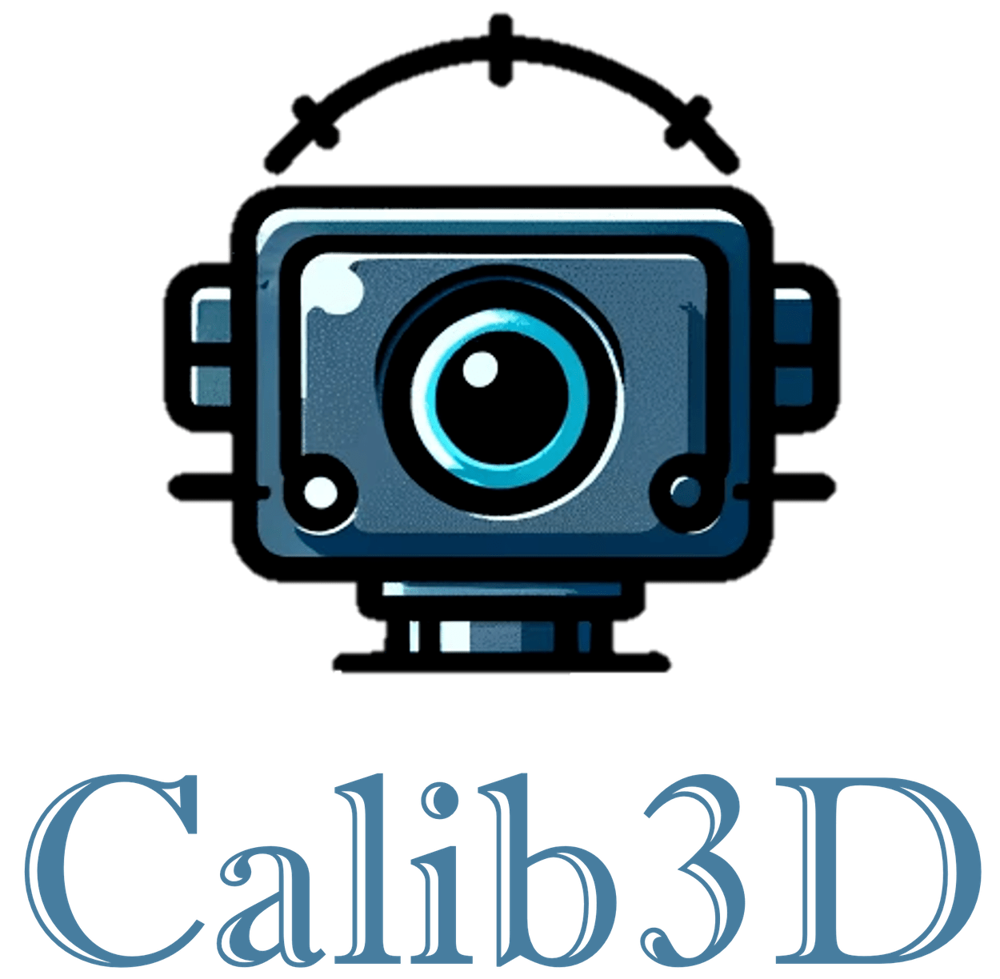
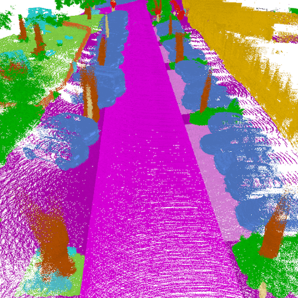

<p align="right">English | <a href="./README_CN.md">简体中文</a></p>  


<p align="center">
  
  
  <h3 align="center"><strong>Calib3D: Calibrating Model Preferences for Reliable 3D Scene Understanding</strong></h3>

  <p align="center">
      <a href="https://ldkong.com/" target='_blank'>Lingdong Kong</a><sup>1,2,*</sup>&nbsp;&nbsp;&nbsp;
      <a href="https://xiangxu-0103.github.io/" target='_blank'>Xiang Xu</a><sup>3,*</sup>&nbsp;&nbsp;&nbsp;
      <a href="https://cen-jun.com/" target='_blank'>Jun Cen</a><sup>4</sup>&nbsp;&nbsp;&nbsp;
      <a href="https://scholar.google.com/citations?user=QDXADSEAAAAJ" target='_blank'>Wenwei Zhang</a><sup>1</sup>
      <br>
      <a href="https://scholar.google.com/citations?user=lSDISOcAAAAJ" target='_blank'>Liang Pan</a><sup>1</sup>&nbsp;&nbsp;&nbsp;
      <a href="https://scholar.google.com/citations?user=eGD0b7IAAAAJ" target='_blank'>Kai Chen</a><sup>1</sup>&nbsp;&nbsp;&nbsp;
      <a href="https://liuziwei7.github.io/" target='_blank'>Ziwei Liu</a><sup>5</sup>
    <br>
  <sup>1</sup>Shanghai AI Laboratory&nbsp;&nbsp;&nbsp;
  <sup>2</sup>National University of Singapore&nbsp;&nbsp;&nbsp;
  <sup>3</sup>Nanjing University of Aeronautics and Astronautics&nbsp;&nbsp;&nbsp;
  <sup>4</sup>The Hong Kong University of Science and Technology&nbsp;&nbsp;&nbsp;
  <sup>5</sup>S-Lab, Nanyang Technological University
  </p>

</p>

<p align="center">
  <a href="" target='_blank'>
    
  </a>
  
  <a href="https://ldkong.com/Calib3D" target='_blank'>
    
  </a>
  
  <a href="" target='_blank'>
    
  </a>
  
  <a href="" target='_blank'>
    
  </a>
  
  <a href="" target='_blank'>
    
  </a>
</p>


## About

`Calib3D` is a comprehensive benchmark targeted at probing the uncertainties of 3D scene understanding models in real-world conditions. It encompasses a systematic study of state-of-the-art models across diverse 3D datasets, laying a solid foundation for the future development of reliable 3D scene understanding systems.

- **Aleatoric Uncertainty in 3D:** We examine how intrinsic factors, such as sensor measurement noises and point cloud density variations, contribute to data uncertainty in 3D scene understanding. Such uncertainty cannot be reduced even with more data or improved models, necessitating efforts that effectively interpret and quantify this inherent variability.
- **Epistemic Uncertainty in 3D:** Different from the rather unified network structures in 2D, 3D scene understanding models shed a wider array of structures due to the complex nature of 3D data processing. Our investigation extends to the model uncertainty associated with the diverse 3D architectures, highlighting the importance of addressing knowledge gaps in model training and data representation.


### Motivation

|  |
| :-: |
| Well-calibrated 3D scene understanding models are anticipated to deliver *low uncertainties* when predictions are accurate and *high uncertainties* when predictions are inaccurate. The plots shown are the point-wise expected calibration error (ECE) rates. The colormap goes from *dark* to *light* denoting *low* and *high* error rates, respectively. |

Visit our [project page]() to explore more examples. :blue_car:


## Updates

- \[2024.03\] - Our [paper]() is available on arXiv. The code has been made publicly accessible. :rocket:


## Outline

- [Installation](#gear-installation)
- [Data Preparation](#hotsprings-data-preparation)
- [Getting Started](#rocket-getting-started)
- [Model Zoo](#dragon-model-zoo)
- [Calib3D Benchmark](#triangular_ruler-calib3d-benchmark)
- [TODO List](#memo-todo-list)
- [Citation](#citation)
- [License](#license)
- [Acknowledgements](#acknowledgements)


## :gear: Installation

For details related to installation and environment setups, kindly refer to [INSTALL.md](docs/INSTALL.md).


## :hotsprings: Data Preparation

| [**nuScenes**](https://www.nuscenes.org/nuscenes) | [**SemanticKITTI**](http://semantic-kitti.org/) | [**Waymo Open**](https://waymo.com/open) | [**SemanticSTF**](https://github.com/xiaoaoran/SemanticSTF) | [**SemanticPOSS**](http://www.poss.pku.edu.cn/semanticposs.html) |
| :-: | :-: | :-: | :-: | :-: |
|  |  |  |  |  |
| [**ScribbleKITTI**](https://github.com/ouenal/scribblekitti) | [**Synth4D**](https://github.com/saltoricristiano/gipso-sfouda) | [**S3DIS**](http://buildingparser.stanford.edu/dataset.html) | [**nuScenes-C**](https://github.com/ldkong1205/Robo3D) | [**SemanticKITTI-C**](https://github.com/ldkong1205/Robo3D) |
|  |  |  |  |  |

Kindly refer to [DATA_PREPARE.md](docs/document/DATA_PREPARE.md) for the details to prepare these datasets.


## :rocket: Getting Started

To learn more usage about this codebase, kindly refer to [GET_STARTED.md](docs/GET_STARTED.md).


## :dragon: Model Zoo

<details open>
<summary>&nbsp<b>Range View</b></summary>

> - [x] **[RangeNet<sup>++</sup>](https://www.ipb.uni-bonn.de/wp-content/papercite-data/pdf/milioto2019iros.pdf), IROS 2019.** <sup>[**`[Code]`**](https://github.com/PRBonn/lidar-bonnetal)</sup>
> - [x] **[SalsaNext](https://arxiv.org/abs/2003.03653), ISVC 2020.** <sup>[**`[Code]`**](https://github.com/TiagoCortinhal/SalsaNext)</sup>
> - [x] **[FIDNet](https://arxiv.org/abs/2109.03787), IROS 2021.** <sup>[**`[Code]`**](https://github.com/placeforyiming/IROS21-FIDNet-SemanticKITTI)</sup>
> - [x] **[CENet](https://arxiv.org/abs/2207.12691), ICME 2022.** <sup>[**`[Code]`**](https://github.com/huixiancheng/CENet)</sup>
> - [x] **[RangeViT](https://arxiv.org/abs/2301.10222), CVPR 2023.** <sup>[**`[Code]`**](https://github.com/valeoai/rangevit)</sup>
> - [x] **[RangeFormer](https://arxiv.org/abs/2303.05367), ICCV 2023.** 
> - [x] **[FRNet](https://arxiv.org/abs/2312.04484), arXiv 2023.** <sup>[**`[Code]`**](https://github.com/Xiangxu-0103/FRNet)</sup>

</details>

<details open>
<summary>&nbsp<b>Bird's Eye View</b></summary>

> - [x] **[PolarNet](https://arxiv.org/abs/2003.14032), CVPR 2020.** <sup>[**`[Code]`**](https://github.com/edwardzhou130/PolarSeg)</sup>

</details>

<details open>
<summary>&nbsp<b>Sparse Voxel</b></summary>

> - [x] **[MinkUNet<sub>18</sub>](https://arxiv.org/abs/1904.08755), CVPR 2019.** <sup>[**`[Code]`**](https://github.com/NVIDIA/MinkowskiEngine)</sup>
> - [x] **[MinkUNet<sub>34</sub>](https://arxiv.org/abs/1904.08755), CVPR 2019.** <sup>[**`[Code]`**](https://github.com/NVIDIA/MinkowskiEngine)</sup>
> - [x] **[Cylinder3D](https://arxiv.org/abs/2011.10033), CVPR 2021.** <sup>[**`[Code]`**](https://github.com/xinge008/Cylinder3D)</sup>
> - [x] **[SpUNet<sub>18</sub>](https://github.com/traveller59/spconv), arXiv 2022.** <sup>[**`[Code]`**](https://github.com/traveller59/spconv)</sup>
> - [x] **[SpUNet<sub>34</sub>](https://github.com/traveller59/spconv), arXiv 2022.** <sup>[**`[Code]`**](https://github.com/traveller59/spconv)</sup>

</details>

<details open>
<summary>&nbsp<b>Multi-View Fusion</b></summary>

> - [x] **[SPVCNN<sub>18</sub>](https://arxiv.org/abs/2007.16100), ECCV 2020.** <sup>[**`[Code]`**](https://github.com/mit-han-lab/spvnas)</sup>
> - [x] **[SPVCNN<sub>34</sub>](https://arxiv.org/abs/2007.16100), ECCV 2020.** <sup>[**`[Code]`**](https://github.com/mit-han-lab/spvnas)</sup>
> - [x] **[RPVNet](https://arxiv.org/abs/2103.12978), ICCV 2021.**
> - [x] **[2DPASS](https://arxiv.org/abs/2207.04397), ECCV 2022.** <sup>[**`[Code]`**](https://github.com/yanx27/2DPASS)</sup>
> - [x] **[CPGNet](https://arxiv.org/abs/2204.09914), ICRA 2022.** <sup>[**`[Code]`**](https://github.com/GangZhang842/CPGNet)</sup>
> - [x] **[GFNet](https://arxiv.org/abs/2207.02605), TMLR 2022.** <sup>[**`[Code]`**](https://github.com/haibo-qiu/GFNet)</sup>
> - [x] **[UniSeg](https://arxiv.org/abs/2309.05573), ICCV 2023.**

</details>

<details open>
<summary>&nbsp<b>Raw Point</b></summary>

> - [x] **[PointNet<sup>++</sup>](https://arxiv.org/abs/1706.02413), NeurIPS 2017.** <sup>[**`[Code]`**](https://github.com/erikwijmans/Pointnet2_PyTorch)</sup>
> - [x] **[DGCNN](https://arxiv.org/abs/1801.07829), TOG 2019.** <sup>[**`[Code]`**](https://github.com/WangYueFt/dgcnn)</sup>
> - [x] **[KPConv](https://arxiv.org/abs/1904.08889), ICCV 2019.** <sup>[**`[Code]`**](https://github.com/HuguesTHOMAS/KPConv)</sup>
> - [x] **[PAConv](https://arxiv.org/abs/2103.14635), CVPR 2021.** <sup>[**`[Code]`**](https://github.com/CVMI-Lab/PAConv)</sup>
> - [x] **[PIDS<sub>1.25x</sub>](https://arxiv.org/abs/2211.15759), WACV 2023.** <sup>[**`[Code]`**](https://github.com/lordzth666/WACV23_PIDS-Joint-Point-Interaction-Dimension-Search-for-3D-Point-Cloud)</sup>
> - [x] **[PIDS<sub>2.0x</sub>](https://arxiv.org/abs/2211.15759), WACV 2023.** <sup>[**`[Code]`**](https://github.com/lordzth666/WACV23_PIDS-Joint-Point-Interaction-Dimension-Search-for-3D-Point-Cloud)</sup>
> - [x] **[WaffleIron](http://arxiv.org/abs/2301.10100), ICCV 2023.** <sup>[**`[Code]`**](https://github.com/valeoai/WaffleIron)</sup>

</details>

<details open>
<summary>&nbsp<b>3D Data Augmentation</b></summary>

> - [x] **[PolarMix](https://arxiv.org/abs/2208.00223), NeurIPS 2022.** <sup>[**`[Code]`**](https://github.com/xiaoaoran/polarmix)</sup>
> - [x] **[LaserMix](https://arxiv.org/abs/2207.00026), CVPR 2023.** <sup>[**`[Code]`**](https://github.com/ldkong1205/LaserMix)</sup>
> - [x] **[FrustumMix](https://arxiv.org/abs/2312.04484), arXiv 2023.** <sup>[**`[Code]`**](https://github.com/Xiangxu-0103/FRNet)</sup>

</details>

<details open>
<summary>&nbsp<b>SparseConv Backend</b></summary>

> - [x] **[MinkowskiEngine](https://arxiv.org/abs/1904.08755), CVPR 2019.** <sup>[**`[Code]`**](https://github.com/NVIDIA/MinkowskiEngine)</sup>
> - [x] **[SpConv](https://github.com/traveller59/spconv), arXiv 2022.** <sup>[**`[Code]`**](https://github.com/traveller59/spconv)</sup>
> - [x] **[TorchSparse](https://arxiv.org/abs/2204.10319), MLSys 2022.** <sup>[**`[Code]`**](https://github.com/mit-han-lab/torchsparse)</sup>
> - [ ] **[TorchSparse<sup>++</sup>](https://www.dropbox.com/scl/fi/obdku0kqxjlkvuom2opk4/paper.pdf?rlkey=0zmy8eq9fzllgkx54zsvwsecf&dl=0), MICRO 2023.** <sup>[**`[Code]`**](https://github.com/mit-han-lab/torchsparse)</sup>

</details>


## :triangular_ruler: Calib3D Benchmark

### In-Domain 3D Uncertainty


### Domain-Shift 3D Uncertainty


## :memo: TODO List
- [x] Initial release. 🚀
- [x] Add 3D calibration benchmarks.
- [x] Add 3D calibration algorithms.
- [x] Add acknowledgments.
- [x] Add citations.
- [ ] Add more 3D scene understanding models.


## Citation
If you find this work helpful for your research, please kindly consider citing our papers:

```bibtex
@article{kong2024calib3d,
    author = {Lingdong Kong and Xiang Xu and Jun Cen and Wenwei Zhang and Liang Pan and Kai Chen and Ziwei Liu},
    title = {Calib3D: Calibrating Model Preferences for Reliable 3D Scene Understanding},
    journal = {arXiv preprint arXiv:2403.},
    year = {2024},
}
```

```bibtex
@inproceedings{kong2023robo3d,
    author = {Lingdong Kong and Youquan Liu and Xin Li and Runnan Chen and Wenwei Zhang and Jiawei Ren and Liang Pan and Kai Chen and Ziwei Liu},
    title = {Robo3D: Towards Robust and Reliable 3D Perception against Corruptions},
    booktitle = {Proceedings of the IEEE/CVF International Conference on Computer Vision (ICCV)},
    pages = {19994--20006},
    year = {2023},
}
```


## License

> <br>
> This work is under the <a rel="license" href="https://www.apache.org/licenses/LICENSE-2.0">Apache License Version 2.0</a>, while some specific operations in this codebase might be with other licenses.

Kindly refer to [LICENSE.md](docs/LICENSE.md) for a more careful check, if you are using our code for commercial matters.


## Acknowledgements

This work is developed based on the [MMDetection3D](https://github.com/open-mmlab/mmdetection3d) codebase.

> <br>
> MMDetection3D is an open-source toolbox based on PyTorch, towards the next-generation platform for general 3D perception. It is a part of the OpenMMLab project developed by MMLab.

Part of the benchmarked models are from the [OpenPCSeg](https://github.com/PJLab-ADG/OpenPCSeg) and [Pointcept](https://github.com/Pointcept/Pointcept) codebases.

We acknowledge the use of the following public resources, during the course of this work: 

:heart: We thank the exceptional contributions from the above open-source repositories!

